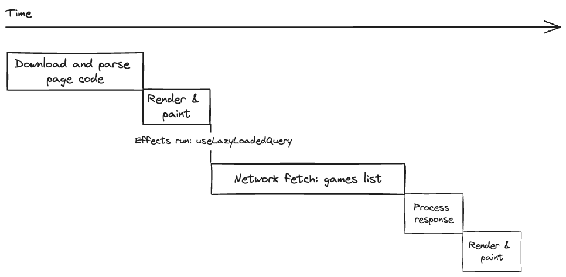
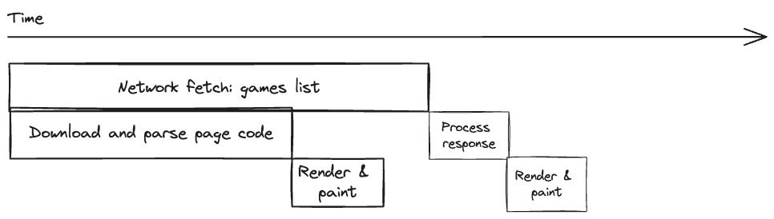

# My Thought Process

This file is a supplement to the README provided at the root. Its purpose is to explain my thought process, technical choices, and the mindset I adopted.

## Adopted Mindset

In this project, I aimed to use tools and technologies that I find suitable for larger-scale projects. This project might not necessarily require such comprehensive technologies, and the initial request could undoubtedly be addressed without them. However, the idea was to answer the question, "What is your ideal tech stack?" and also to elucidate the reasons behind my choices.

## Chosen Technologies

- **NextJS**
  - Server-side rendering with React.
  - Strong optimization capabilities.
  - Developed by Vercel with a robust community. Notably, some Vercel developers are part of the React team.

- **Relay**
  - Developed and extensively used by Facebook in their projects.
  - Allows each component to declare its data requirements without worrying about constructing the GraphQL query.
  - Significantly enhances performance and includes caching.

## Folder Structure

The project's code is located in the `src` directory, which contains the following subdirectories:

- `app`: [Next.js App Router](https://nextjs.org/docs/app)
- `features`: This directory contains feature components that can be reused across different pages.
- `lib`: This directory includes custom libraries used in our code.

## Data Fetching Strategy

This project includes two pages that list items:

- `/games`: A page that displays a list of games, ordered from the most recent to the oldest.
- `/players`: A page that lists players along with their statistics.

These two pages load differently, with the intent of showcasing the advantages of server-side rendering in Next.js.

### Loading the `/games` page

This page is relatively easy. The server sends the HTML to the client, which is then hydrated with React on the client side. Once this is done, and the [<GamesList />](https://github.com/mathieumetral/foosball-scores-frontend/blob/main/src/features/games/components/games-list.tsx) component has rendered, the GraphQL query is loaded using the Relay `useLazyLoadQuery` hook. This process can be visualized with the following diagram:

Notice how there's a delay before the GraphQL query even starts fetching. Ideally, the query fetch should begin at the same moment the server sends back the HTML page. The challenge is that the HTML page wouldn't render until the data has been loaded. This is where the power of Next.js comes into play. Next.js has the ability to stream the page content, allowing it to first deliver the content to display the page, and then subsequently send the data.

### Loading the `/players` page

It's on this page that we optimally load the data. As mentioned earlier, Next.js will initiate the query to our backend as soon as a client requests the relevant page. This results in the following diagram:

We can thus see the time saved. Moreover, let's not forget that when the Next.js server makes a request to our backend, network latency is typically reduced. This is because, in most instances, the server hosting our site is located in the same place as the backend responding to it. Or, in the case of a project on a k8s cluster, the server can directly request the backend without even going through the internet, further reducing network latency.

**Bonus**

I've also added on this page the ability to retry data loading. Indeed, if the server, for any reason, fails to retrieve the data, it's problematic. This would force the client to have to refresh. Fortunately, we can use an ErrorBoundary with a retry function to offer a "Try Again" button. This button then performs the request when the user clicks on it, providing an optimal interface and minimizing client frustration even in case of an error.

_This feature can be tested by stopping the backend and then trying to load the page. Afterward, restart the backend and try the "Try Again" button!_
